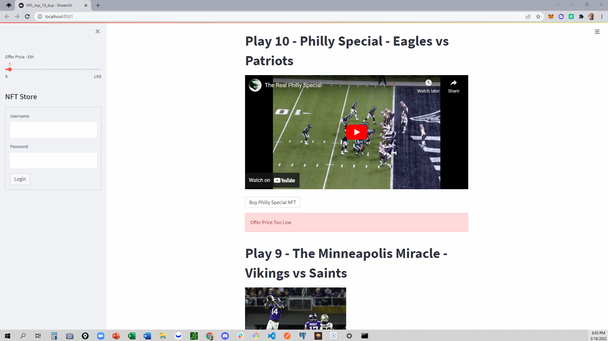
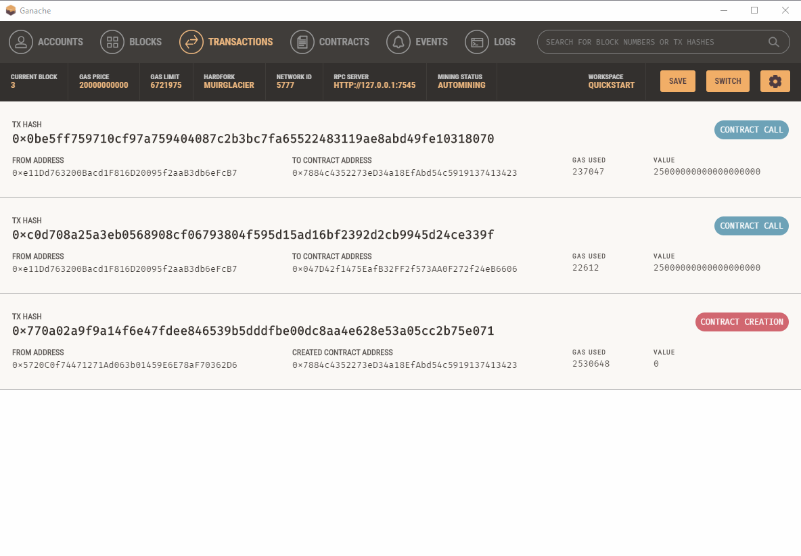

# Top 10 NFL Plays of All Time - NFT Marketplace

Carl Buchholz, Chris Kwiatkowski, Troy Albany, Edward Schryver

---
## Scope and Origin

In the history of the NFL, there have been many remarkable plays. There 
have  been plays that made you laugh, plays that made you cry, and plays 
that just made you scratch your head and wonder why. For the first time, we 
bring to you the chance  to own a piece of history. These are the NFL’s all 
time top 10 plays, and today they can be yours. This limited collection will be
offered one time only. Place your bid and become the proud owner of plays 
that many say will probably never happen again! We have curated what we 
believe are the best plays ever. If you meet the qualifying bid, you can be 
the proud owner of plays such as The Music City Miracle, or The Catch, and 
who can forget, one of the greatest plays of all...The Philly Special!  The next
time someone talks about The Immaculate Reception, you can proudly say 
you OWN it! Time is running out. Don’t let someone else own what could be 
yours. Just click on the left, place your bid, and enter a world that few have 
traveled. Buy 1, 2, or all 10, but act now before it’s too late! Get a token of 
your appreciation of great American Football.

---

## Smart Contract (Back End)

We used remix to create the smart contract. For the purpose of this project, all that was needed was one function in the smart contract that serves to mint the token named "Top10NFLtoken", with the symbol "TOP."

---

## NFT Marketplace Site Functionality 

Our NFT Marketplace serves as a place where one can go to see each of the top ten plays that are available as NFTs and can mint and purchase the NFT if they so choose.  On the left side of the site, there is a slidebar where the person can choose the price he or she would like to bid to mint the NFT. The minimum price to mint one of the NFT's is 20 ETH.  If someone tried to mint one for under 20 ETH, an error message pops up saying "Offer Price Too Low as seen below." 

If someone bids 20 ETH or more, the site will display a successful transaction receipt showing a transaction hash, the from wallet address of the person who minted the NFT and the to address which is the address of the smart contract.

## VS Code (Front End)

The code to create the slidebar, show the title of the NFT Marketplace, play the background music, and create the individual purchase contract was written in Visual Studio Code and can be seen below.

## Testing

To deploy the smart contract and confirm the minting works, we used sample accounts from Ganache and imported them into MetaMask and did a test run by minting an NFT with one of the sample addresses. Below shows the transactions of the creation of the smart contract and one successful minting of an NFT.

Back in remix, by plugging in the address that purchased the NFT into the "balnceOf" feature, it can be seen that address now owns 1 NFT. Likewise, by plugging in the smart contract address into the "totalSupply" feature, it can be seen that this smart contract has been used to mint 1 NFT.

---

## Concluding Remarks

Throughout the streamlit process we hit a number of road blocks in which we would have dove into further with more time.
We went ahead and deployed a version of our application to see the final product and if the code would deploy properly. Many of the features ran smoothly but we ran into a few issues along the way. The first issue was getting streamlit player to install allowing the music and videos to display correctly. We were able to get streamlit player to install by importing the S-Y-S and subprocess libraries. You can see the lines of code used in this picture here.	

 The installation of the streamlit player seemed to slow the time it took to switch back and forth between the two pages and properly load all the function and features. Another issue we ran into was getting the background pictures to properly display when deploying the app. We ran into a similar issue when importing the background on the local host as well. This is something we would have liked to dive into further if there was more time. We have provided screen shots of a few backgrounds we would like to import into our application such as a football background for the NFT marketplace.
A few other functions and features we would like to implement with more time is the use of an ebay style auction system for the NFT purchases and music automatically playing when switching to the “NFT Store” page of the application. 
The user would log in using their email and password to access the NFT marketplace. Once logged in, each NFT would have a minimum bid amount as well as a “purchase now” amount. 
We also felt it would be nice to have music playing in the background at all times whether it would be the same song on repeat or a list of songs that the app shuffles through. 
The last feature we thought would be helpful was if the page automatically scrolled to the play being purchased when it is selected in a dropdown menu of the sidebar. 
We felt with more time we could implement many helpful intuitive features. 
Thank you all for listening to our capstone project and we would like to open the floor to any questions or comments.

